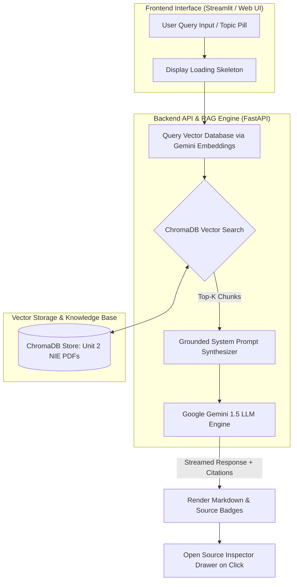

<div align="center">

  # 🧬 CellMate

  ### *Precision AI Tutor for Sri Lanka G.C.E. A/L Biology*

  [](https://www.python.org/)
  [](https://fastapi.tiangolo.com/)
  [](https://streamlit.io/)
  [](https://ai.google.dev/)
  [](https://www.trychroma.com/)
  [](https://www.w3.org/TR/WCAG21/)
  [](LICENSE)

  <p align="center">
    An AI-powered Retrieval-Augmented Generation (RAG) assistant specifically engineered for Sri Lankan G.C.E. Advanced Level (A/L) Biology students (English Medium), strictly grounded in the official <b>National Institute of Education (NIE) Biology Resource Book</b>.
  </p>

  [Explore PRD](doc/PRD.md) • [View Design Brief](doc/design_brief.md) • [Architecture Blueprint](doc/ARCHITECTURE.md) • [Interactive Design Preview](doc/design_system_preview.html)

</div>

---

## 📑 Table of Contents

- [🚨 Problem Statement](#-problem-statement)
- [💡 The Solution](#-the-solution)
- [👤 User Stories](#-user-stories)
- [✨ Key Features](#-key-features)
- [🏗️ System Architecture \& Data Flow](#️-system-architecture--data-flow)
- [🛠️ Tech Stack](#️-tech-stack)
- [📋 System Requirements](#-system-requirements)
- [🚀 Quick Start Setup](#-quick-start-setup)
- [📚 Documentation Hub](#-documentation-hub)
- [📄 License](#-license)

---

## 🚨 Problem Statement

Sri Lankan G.C.E. Advanced Level (A/L) Biology is one of the most competitive national examinations. Students face two critical obstacles during exam revision:

1. **Strict NIE Marking Schemes**: Examination evaluation requires exact terminology, biological definitions, and keywords specified in the official **National Institute of Education (NIE) Resource Book**. Generic AI models (e.g. ChatGPT, Claude) frequently hallucinate or rely on foreign syllabi (AP / IB / Cambridge Biology), causing students to lose vital exam marks.
2. **Information Retrieval Fatigue**: Finding exact page references across 1,000+ pages of dense resource books, past papers, and model marking schemes consumes excessive study time.

---

## 💡 The Solution

**CellMate** solves this by creating a closed-loop **Retrieval-Augmented Generation (RAG)** pipeline.

When a student submits a question:
* CellMate queries a local vector store (**ChromaDB**) populated with extracted NIE Resource Book chunks (MVP: **Unit 2 — Chemical and Cellular Basis of Life**).
* Retrieved context is fed into **Google Gemini 1.5** with strict system instructions prohibiting out-of-syllabus terms.
* The system streams a zero-hallucination, syllabus-compliant response complete with **interactive page-level citation badges**.

---

## 👤 User Stories

### 🎓 Primary Persona: G.C.E. A/L Biology Student
> *"As an A/L Biology student preparing for Unit 2 exams, I want instant, accurate answers that match the exact NIE Resource Book definitions so that I can write full-mark answers in my A/L examination."*

### 👩‍🏫 Secondary Persona: A/L Biology Educator / Tutor
> *"As a Biology teacher, I want an instant citation tool that references precise page numbers from NIE resource books and past paper marking schemes so that I can quickly verify student answers during revision sessions."*

---

## ✨ Key Features

- 🎯 **Grounding in Official NIE Syllabus**: Guarantees zero out-of-syllabus terms or foreign biological nomenclature.
- 📖 **Page-Level Source Citation Inspector**: Clickable citation badges (`📖 NIE Resource Book Pg 14`) open a slide-out drawer displaying exact document extracts and confidence scores.
- ⚡ **Revision Prompt Starter Chips**: Quick one-click prompt starters for core topics (*Properties of Water*, *Enzyme Kinetics & Inhibition*, *Protein Structure*).
- 🔬 **Unit 2 Sub-Topic Navigation**: Filter by sub-units including Chemical Basis, Biomolecules, Enzymes, Cell Organelles, and Mitosis.
- ♿ **WCAG 2.1 AA Compliant UI**: Built with accessible contrast ratios, dark mode aesthetics, and keyboard accessibility.

---

## 🏗️ System Architecture & Data Flow



---

## 🛠️ Tech Stack

| Component | Technology | Description |
| :--- | :--- | :--- |
| **Language** |  | Core application runtime |
| **API Backend** |  | High-performance REST endpoints (`POST /query`, `GET /health`) |
| **Web Frontend** |  | Interactive student workspace & drawer UI |
| **LLM Engine** |  | Grounded generative reasoning |
| **Embeddings** |  | High-dimensional semantic vectors |
| **Vector DB** |  | Local persistent vector storage |
| **PDF Extraction** | `pdfplumber` / `pypdf` | Page-aware text extraction & semantic chunking |

---

## 📋 System Requirements

- **Operating System**: Windows 10/11, macOS, or Linux
- **Python Version**: Python `3.10` or higher
- **API Key**: Active [Google Gemini API Key](https://aistudio.google.com/)

---

## 🚀 Quick Start Setup

### 1. Clone & Navigate to Repository
```bash
git clone https://github.com/Suhira30/CellMate.git
cd CellMate
```

### 2. Set Up Virtual Environment
```bash
# Windows
python -m venv venv
.\venv\Scripts\activate

# macOS / Linux
python3 -m venv venv
source venv/bin/activate
```

### 3. Install Dependencies
```bash
pip install -r requirements.txt
```

### 4. Configure Environment Variables
Copy `.env.example` to `.env` and add your Google Gemini API key:
```env
GEMINI_API_KEY=your_actual_gemini_api_key_here
EMBEDDING_MODEL=gemini-embedding-2
LLM_MODEL=gemini-1.5-flash
```

### 5. Place Resource Materials
Place your NIE Biology Resource Book Unit 2 PDF inside the raw data directory:
```
data/raw/resource_book/Unit_2_NIE_Resource_Book.pdf
```

### 6. Launch Application
```bash
# Launch Streamlit Frontend
streamlit run frontend/app.py

# (Optional) Launch FastAPI REST API
uvicorn src.api.main:app --reload
```

---

## 📚 Documentation Hub

All detailed product design and system architecture specifications are available in the [`doc/`](doc/) directory:

- 📄 **[Product Requirements Document (PRD)](doc/PRD.md)**: Product goals, functional specs, non-functional requirements, and roadmap.
- 🎨 **[Product Design Brief](doc/design_brief.md)**: User flows, screen layouts, design tokens, component library, and WCAG accessibility notes.
- 💻 **[Interactive Design System Preview](doc/design_system_preview.html)**: Interactive visual prototype built with Tailwind CSS.
- 🏗️ **[System Architecture Roadmap](doc/ARCHITECTURE.md)**: Component diagrams, technical stack, and staged checkboxes.

---

## 📄 License

Distributed under the MIT License. See `LICENSE` for more information.

<div align="center">

  Made with ❤️ for Sri Lankan G.C.E. A/L Biology Students

</div>
