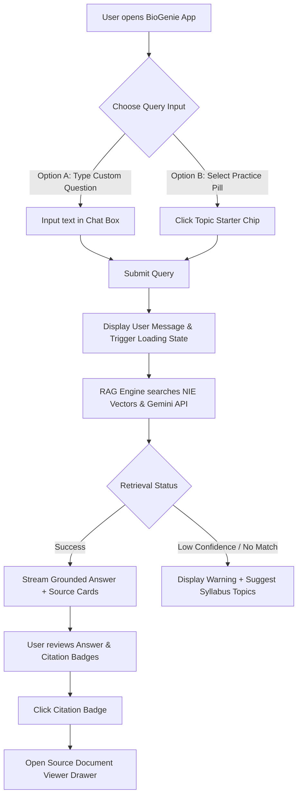
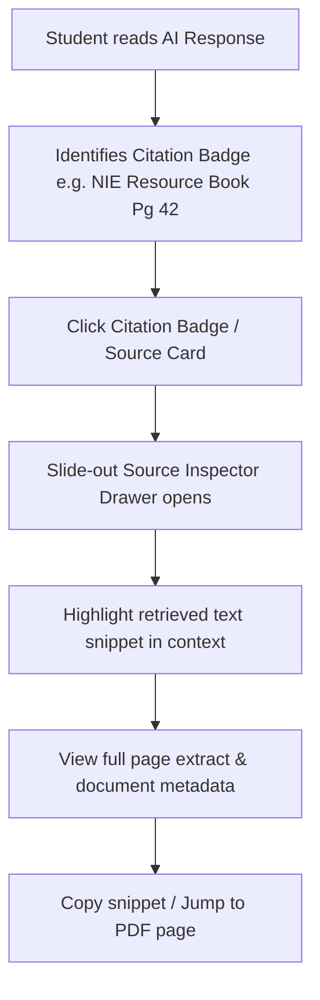
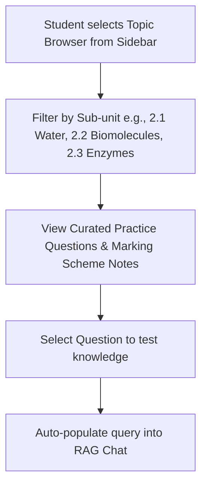

# Product Design Brief: A/L BioGenie

**Sri Lanka G.C.E. A/L Biology RAG Tutor (Unit 2: Chemical & Cellular Basis of Life)**

---

## 1. Executive Summary & Product Context

### 1.1 Product Overview

**A/L BioGenie** is a high-precision, AI-powered Retrieval-Augmented Generation (RAG) assistant specifically engineered for Sri Lankan G.C.E. Advanced Level (A/L) Biology students (English Medium). The initial MVP targets **Unit 2: Chemical and Cellular Basis of Life**, grounding all generated explanations directly in the official **National Institute of Education (NIE) Biology Resource Book**, past examination marking schemes, and model papers.

### 1.2 Target Personas

1. **G.C.E. A/L Biology Student (Primary)**
   - **Needs**: Accurate, syllabus-compliant answers that match exact NIE marking scheme terminology to maximize exam marks; instant page-level citations to verify answers against official resource books.
   - **Pain Points**: Confusing international terminology (e.g., AP/IB Biology vs. NIE syllabus specs), risk of AI hallucinations in generic LLMs, difficulty finding precise page references in lengthy PDFs.
2. **A/L Biology Teacher / Tutor (Secondary)**
   - **Needs**: Reliable source citation verification, quick access to exemplar questions for Unit 2 topics, and rapid verification of student answers against NIE marking criteria.

---

## 2. User Flows

### Flow 1: Primary Query & Grounded Answer Flow



### Flow 2: Citation Inspection & Source Verification Flow



### Flow 3: Topic-Based Revision Flow



---

## 4. Screen Inventory

| Screen / View ID | Screen Name                                  | Key Purpose                                                                                | Primary Actions                                                                 |
| :--------------- | :------------------------------------------- | :----------------------------------------------------------------------------------------- | :------------------------------------------------------------------------------ |
| **SCR-01**       | **Main Chat & Workspace (Dashboard)**        | Core interaction space for querying, receiving answers, and browsing conversation context. | Type query, trigger example prompts, view response, copy answer, rate response. |
| **SCR-02**       | **Source Inspector Drawer (Overlay)**        | Inspect exact NIE page snippets and verified document sources.                             | Read source context, view confidence score, jump to page in viewer.             |
| **SCR-03**       | **Syllabus & Topic Browser (Sidebar / Tab)** | Navigate Unit 2 sub-topics (Water, Proteins, Enzymes, Organelles, Cell Division).          | Filter topics, trigger recommended past paper questions.                        |
| **SCR-04**       | **System & Vector Store Status (Modal)**     | Monitor vector database indexing status, backend API health, and model parameters.         | Check health, view indexed document count, trigger re-index (Admin).            |

---

## 5. Screen Layout & Structural Wireframes

### SCR-01: Main Chat & Workspace Layout

```
+---------------------------------------------------------------------------------------------------+
|  [Logo] A/L BioGenie  | Unit 2: Chemical & Cellular Basis |  [Health: Online]  [Theme Toggle]      |
+---------------------------------------------------------------------------------------------------+
| SIDEBAR (Fixed 280px)            | MAIN CHAT AREA (Flex Grow)                                     |
|                                  |                                                                |
| [ + New Chat Session ]           | +------------------------------------------------------------+ |
|                                  | | WELCOME BANNER                                             | |
| -- SYLLABUS UNIT 2 TOPICS --     | | 🧬 Master G.C.E. A/L Biology Unit 2 with NIE Grounded AI   | |
| [*] 2.1 Chemical Basis & Water   | +------------------------------------------------------------+ |
| [ ] 2.2 Organic Compounds        |                                                                |
| [ ] 2.3 Enzymes & Kinetics       | QUICK SUGGESTION CHIPS                                         |
| [ ] 2.4 Cell Structure & Function| [ Properties of Water ] [ Enzyme Inhibition ] [ Protein Structure ]|
| [ ] 2.5 Cell Division (Mitosis)  |                                                                |
|                                  | CHAT STREAM                                                    |
| -- RECENT CHATS --               | +------------------------------------------------------------+ |
| • Competitive Inhibition         | | [User] What are the properties of water essential for life?| |
| • Water Thermal Properties       | +------------------------------------------------------------+ |
| • Protein Structures             | | [BioGenie AI]                                             | |
|                                  | | Grounded Answer based on NIE Resource Book Unit 2:         | |
| -- SYSTEM INFORMATION --         | | 1. High Specific Heat Capacity...                          | |
| Knowledge Base: NIE Unit 2       | | Sources: [NIE Unit 2 - Pg 14] [2021 Past Paper Q2]        | |
| LLM: Gemini Grounded             | +------------------------------------------------------------+ |
|                                  |                                                                |
|                                  | INPUT CONTAINER (Sticky Bottom)                                |
|                                  | +------------------------------------------------------------+ |
|                                  | | [Input: Ask any question from Unit 2...]          [Send] | |
|                                  | +------------------------------------------------------------+ |
+---------------------------------------------------------------------------------------------------+
```

### SCR-02: Source Inspector Drawer Layout (Right Overlay)

```
+------------------------------------------------------------------+
| SOURCE INSPECTOR                                            [ X ]|
+------------------------------------------------------------------+
| Document: NIE Biology Resource Book (Unit 2)                     |
| Page: 42 | Section: 2.3.1 Enzyme Inhibition                    |
| Match Confidence: 96% Grounded                                   |
+------------------------------------------------------------------+
| RETRIEVED TEXT SNIPPET                                           |
| +--------------------------------------------------------------+ |
| | "...Competitive inhibitors bind reversibly to the active    | |
| | site of the enzyme, competing directly with substrate...     | |
| +--------------------------------------------------------------+ |
|                                                                  |
| MARKING SCHEME KEYWORDS MATCHED                                  |
| [Active Site] [Reversible Binding] [Substrate Competition]       |
|                                                                  |
| [ Download Page PDF Extract ]         [ Copy Citation Text ]     |
+------------------------------------------------------------------+
```

---

## 6. Component Inventory

### 6.1 Basic Components (Atoms)

- **`Button`**: Primary (Brand Bio Teal), Secondary (Neutral Surface), Outline, Text/Icon button.
- **`Badge / Chip`**: Source Citation Chip (interactive badge with page number), Topic Selector Pill, Status Pill (Online / Syncing).
- **`TextInput / ChatInput`**: Auto-resizing textarea with embedded send button and keyboard submit (`Enter`).
- **`Icon`**: Biology-themed SVGs (DNA/Gene, Leaf/Cell, Book/Citation, Sparkles, CheckCircle, AlertTriangle).
- **`Spinner`**: Radial biological pulse spinner for loading states.

### 6.2 Composite Components (Molecules)

- **`ChatMessageCard`**: Distinct user vs. assistant bubbles with rich markdown rendering, LaTeX formula support, and citation footer.
- **`SourceCitationCard`**: Compact preview box showing source title, page thumbnail, and confidence tag.
- **`PromptSuggestionGroup`**: Horizontal scrollable list of quick topic starter buttons.
- **`SidebarNavigationItem`**: Interactive list item with active state indicator and count badge.

### 6.3 Complex Layout Components (Organisms)

- **`ChatContainer`**: Virtualized message list with auto-scroll down, sticky bottom input, and floating "Scroll to bottom" button.
- **`SourceInspectorDrawer`**: Slide-over panel presenting full document context, extracted text chunk, and metadata.
- **`SyllabusTopicTree`**: Collapsible menu mapping Unit 2 sub-topics to quick question generators.

---

## 7. Design Tokens

### 7.1 Color Palette

```
   ┌─────────────────────────────────────────────────────────────┐
   │ BRAND ACCENTS (Biological / BioTech Teal & Emerald)        │
   │ Brand Primary:    #0D9488 (Teal 600 - NIE Official Theme)   │
   │ Brand Hover:      #0F766E (Teal 700)                        │
   │ Brand Light:      #CCFBF1 (Teal 100 - Citation Highlights)  │
   │ Secondary Accent: #059669 (Emerald 600 - Academic Success)  │
   └─────────────────────────────────────────────────────────────┘
   ┌─────────────────────────────────────────────────────────────┐
   │ SEMANTIC SURFACES & BACKGROUNDS                             │
   │ Light Background:  #F8FAFC (Slate 50)                       │
   │ Light Surface/Card:#FFFFFF (Pure White)                     │
   │ Light Border:      #E2E8F0 (Slate 200)                      │
   │ Dark Background:   #0F172A (Slate 900)                      │
   │ Dark Surface/Card: #1E293B (Slate 800)                      │
   │ Dark Border:       #334155 (Slate 700)                      │
   └─────────────────────────────────────────────────────────────┘
   ┌─────────────────────────────────────────────────────────────┐
   │ TYPOGRAPHY NEUTRALS                                         │
   │ Text Primary:   #0F172A (Slate 900) / #F8FAFC (Dark Mode)   │
   │ Text Secondary: #475569 (Slate 600) / #94A3B8 (Dark Mode)   │
   │ Text Muted:     #64748B (Slate 500) / #64748B (Dark Mode)   │
   └─────────────────────────────────────────────────────────────┘
   ┌─────────────────────────────────────────────────────────────┐
   │ STATUS & ALERT COLORS                                       │
   │ Success: #16A34A (Green 600 - Strict Syllabus Match)       │
   │ Warning: #D97706 (Amber 600 - Low Context Grounding)        │
   │ Error:   #DC2626 (Red 600 - Out of Syllabus / API Error)     │
   │ Info:    #2563EB (Blue 600 - NIE Resource Book Note)        │
   └─────────────────────────────────────────────────────────────┘
```

### 7.2 Typography Scale

Font Family: Primary: `Inter`, `system-ui`, sans-serif. Monospace (Code/Citations): `JetBrains Mono`, monospace.

| Role                   | Size               | Line Height   | Weight           | Usage                             |
| :--------------------- | :----------------- | :------------ | :--------------- | :-------------------------------- |
| **Display Header**     | `28px (1.75rem)`   | `36px (1.25)` | Bold (`700`)     | Main Screen Title                 |
| **Section Header**     | `20px (1.25rem)`   | `28px (1.4)`  | SemiBold (`600`) | Sidebar Headers, Modal Titles     |
| **Subtitle / Subhead** | `16px (1.0rem)`    | `24px (1.5)`  | Medium (`500`)   | Card Titles, Topic Headers        |
| **Body Primary**       | `15px (0.9375rem)` | `24px (1.6)`  | Regular (`400`)  | Main AI Response Text, Chat Input |
| **Body Small**         | `13px (0.8125rem)` | `18px (1.4)`  | Regular (`400`)  | Source Snippets, Metadata         |
| **Caption / Badge**    | `11px (0.6875rem)` | `14px (1.27)` | SemiBold (`600`) | Citation Badges, Page Numbers     |

### 7.3 Spacing Scale & Elevation

- **Spacing Scale**: `4px` (xs), `8px` (sm), `12px` (md), `16px` (lg), `24px` (xl), `32px` (2xl), `48px` (3xl).
- **Border Radius**: `6px` (Inputs/Badges), `12px` (Cards/Modals), `24px` (Pills/Buttons).
- **Elevation / Shadows**:
  - `shadow-sm`: `0 1px 2px 0 rgba(0, 0, 0, 0.05)` (Cards, Input Bar)
  - `shadow-md`: `0 4px 6px -1px rgba(0, 0, 0, 0.1)` (Dropdowns, Hover Cards)
  - `shadow-xl`: `0 20px 25px -5px rgba(0, 0, 0, 0.1)` (Drawer Overlays, Modals)

---

## 8. UI States Matrix

| Component / Screen          | Empty State                                                                                      | Loading State                                                                                                       | Error State                                                                                               | Success State                                                                                       |
| :-------------------------- | :----------------------------------------------------------------------------------------------- | :------------------------------------------------------------------------------------------------------------------ | :-------------------------------------------------------------------------------------------------------- | :-------------------------------------------------------------------------------------------------- |
| **Main Chat Area**          | Shows Welcome Banner, Unit 2 overview, and 3-4 clickable topic prompt starter pills.             | Skeleton message cards + pulse animation with label _"Searching NIE Resource Book & Generating Grounded Answer..."_ | Red alert banner _"Unable to retrieve context. Check API Key or connectivity."_ with Retry action button. | Clean markdown response rendered with bold NIE key terms, bullet points, and green citation badges. |
| **Source Inspector Drawer** | Panel text _"Click any citation badge in a response to view the official NIE document extract."_ | Skeleton text lines with shimmering effect.                                                                         | _"Document page snippet unavailable in vector index."_                                                    | Complete PDF text extract highlighted with matching syllabus keywords.                              |
| **Input Bar**               | Placeholder _"Ask any question from Unit 2 (e.g. Enzyme inhibition, Water properties)..."_       | Input disabled with spinner on send button while answer generates.                                                  | Red border highlight if character limit exceeded or blank query submitted.                                | Active input ready for next follow-up question.                                                     |
| **Syllabus Browser**        | _"Select a topic to view curated past paper questions."_                                         | Shimmering list items.                                                                                              | _"Failed to load syllabus index."_                                                                        | Interactive accordion list of sub-units with question counts.                                       |

---

## 9. Accessibility (a11y) Notes

### 9.1 WCAG 2.1 AA Compliance Requirements

1. **Color Contrast Ratios**:
   - Text Primary (`#0F172A`) against Light Background (`#F8FAFC`) = **15.8:1** (Exceeds 4.5:1 AAA).
   - Brand Teal (`#0D9488`) text on Light Surface = **4.8:1** (Passes AA).
   - White text on Brand Teal button (`#0D9488`) = **4.6:1** (Passes AA).
2. **Keyboard Navigation**:
   - `Tab` / `Shift+Tab` cycles logically through: Sidebar Navigation -> Topic Starter Pills -> Chat Messages -> Input Field -> Send Button.
   - `Escape` closes the Source Inspector Drawer and any open modal.
   - `Enter` submits query (Shift+Enter inserts new line).
3. **Screen Reader Optimization (ARIA)**:
   - Chat message stream marked with `aria-live="polite"` so new AI responses are read automatically as they finish streaming.
   - Citation badges marked with `aria-label="Citation: NIE Biology Resource Book Page 42, click to open source inspector"`.
   - Loading spinners equipped with `role="status"` and visually hidden text _"Generating answer from NIE Resource Book..."_.
4. **Cognitive Accessibility & Text Formatting**:
   - Clear visual hierarchy with prominent headings for AI responses.
   - Technical biological terms (e.g., _Phosphodiester bond_, _Competitive inhibition_) rendered in **bold** to reduce visual fatigue for A/L revision.
   - Support for custom text scaling up to 200% without breaking horizontal scroll layouts.

---

## 10. Implementation & Designer Hand-Off Notes

- **Design Tokens Integration**: Custom Tailwind CSS design variables mapped to standard CSS custom properties.
- **Iconography**: Use Lucide-React / Feather Icons for consistent 2px stroke weight.
- **Responsive Behavior**:
  - **Desktop (>= 1024px)**: Dual pane with persistent 280px sidebar and sliding drawer overlay.
  - **Tablet / Mobile (< 1024px)**: Collapsible hamburger drawer for sidebar; full-screen modal overlay for Source Inspector.
